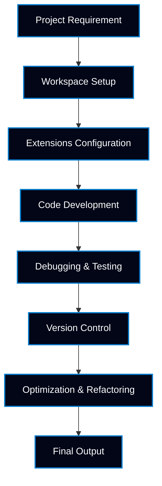

<!-- =============================================================== -->
<!-- ========== VISUAL STUDIO CODE PROFESSIONAL PORTFOLIO =========== -->
<!-- =============================================================== -->

<p align="center">
  
</p>

<h1 align="center">🧩 Visual Studio Code Professional Portfolio</h1>

<p align="center">
<b>VS Code • Developer Productivity • Modern Coding Practices</b><br>
Showcasing <b>editor mastery, extensions ecosystem, workflows, debugging techniques, and real-world development efficiency</b>
</p>

<p align="center">
🚀 Designed for <b>Developers | Data Analysts | Students | Educators | Recruiters</b>
</p>

---

## 📌 Repository Overview

```txt
Domain           : Developer Tools & Productivity
Primary Tool     : Visual Studio Code
Skill Level      : Intermediate to Advanced
Focus Areas      : Editor Mastery | Extensions | Debugging | Git
Use Cases        : Coding | Analytics | Teaching | Automation
Learning Style   : Hands-on | Practical | Workflow-Based
Outcome          : Industry-Ready VS Code User Profile
```

This repository is a **comprehensive Visual Studio Code portfolio** created to demonstrate:

* Deep understanding of **VS Code features & architecture**
* Efficient **developer workflows**
* Smart usage of **extensions & settings**
* Debugging, automation, and version control integration
* Productivity techniques used in **real-world projects**

---

## 🧠 What This VS Code Portfolio Demonstrates

This repository reflects:

* Practical mastery of **Visual Studio Code**
* Ability to configure VS Code for **multiple roles**
* Clean & efficient **coding environments**
* Best practices for **learning, teaching & professional work**
* Tool-based thinking required in **modern development & analytics**

---

## 🔥 Repository Metrics (Live)

📡 GitHub Activity Indicators

<p align="center">
  
  
  
  
</p>

<p align="center">
<b>📊 Automatically updated engagement & usage metrics</b>
</p>

---

## 🎯 VS Code Portfolio Objectives (Industry-Oriented)

* Master **VS Code interface & shortcuts**
* Configure **extensions for productivity**
* Implement **debugging & error handling**
* Integrate **Git & GitHub workflows**
* Improve **coding speed & accuracy**
* Build **professional development environments**
* Prepare **tool-based interview readiness**

---

## 🧠 VS Code Skills Mapped to Industry Needs

| Industry Requirement   | VS Code Skill Demonstrated      |
| ---------------------- | ------------------------------- |
| Efficient Coding       | Shortcuts & Command Palette     |
| Developer Productivity | Extensions & Workspace Settings |
| Code Quality           | Linting & Formatting Tools      |
| Debugging              | Built-in Debugger               |
| Version Control        | Git & GitHub Integration        |
| Multi-Language Support | Python, SQL, JS, C, etc.        |
| Team Collaboration     | Settings Sync & Profiles        |

---

## 🔄 VS Code Workflow Lifecycle



---

## 🧭 VS Code Learning Roadmap


---

## 🧪 Typical VS Code Repository Structure

```txt
📁 VS_Code_Project/
│
├── ⚙️ settings.json
├── 🧩 extensions.md
├── ⌨️ shortcuts.md
├── 🐞 debugging.md
├── 🔄 git_workflows.md
├── 📄 use_cases.md
└── 📑 README.md
```

---

## 📊 VS Code Concepts Covered

* Editor Layout & Navigation
* Command Palette
* Extensions Marketplace
* Workspace & User Settings
* Debugging Configuration
* Git & Source Control
* Multi-language Support
* Performance Optimization

---

## 🛠️ Tools & Technology Stack

| Tool / Platform    | Usage                        |
| ------------------ | ---------------------------- |
| Visual Studio Code | Core Development Environment |
| Git                | Version Control              |
| GitHub             | Repository & Collaboration   |
| Python / SQL / JS  | Practice & Demonstrations    |
| JSON               | Configuration & Settings     |

---

## 🔗 Share & Promote This VS Code Portfolio

<p align="center">
  <a href="https://www.linkedin.com/sharing/share-offsite/?url=https://github.com/Ashwin18-Offcl/VS_Code_Portfolio">
    
  </a>
  <a href="https://twitter.com/intent/tweet?url=https://github.com/Ashwin18-Offcl/VS_Code_Portfolio&text=Visual%20Studio%20Code%20Professional%20Portfolio">
    
  </a>
</p>

<p align="center">
<b>💡 Ideal for recruiters, educators, learners & professionals</b>
</p>

---

## 🧑‍💻 Author

**Ashwin Ananta Panbude**
Data Analyst | BI Developer | Faculty

<p align="center">
  <a href="https://github.com/Ashwin18-Offcl">
    
  </a>
  <a href="https://bit.ly/49pSuZJ">
    
  </a>
</p>

---

## 📝 Final Summary

This repository presents **Visual Studio Code as a professional skill**, not just a tool.
It highlights **productivity, efficiency, and real-world workflows**, aligned with **modern development, analytics, and teaching requirements**.

